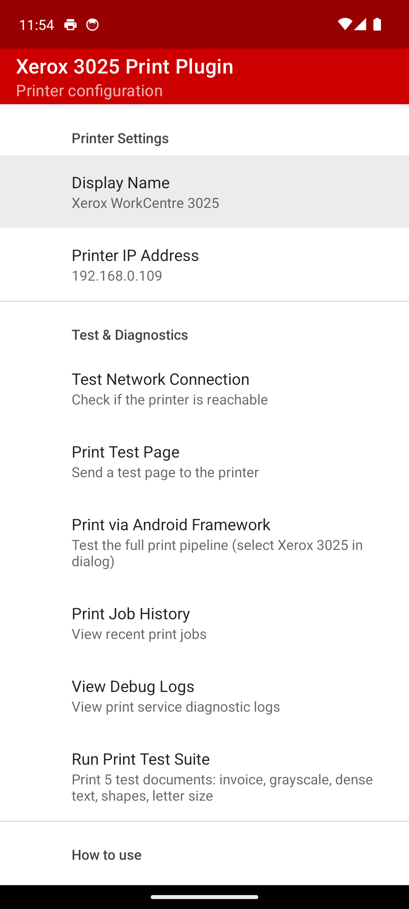
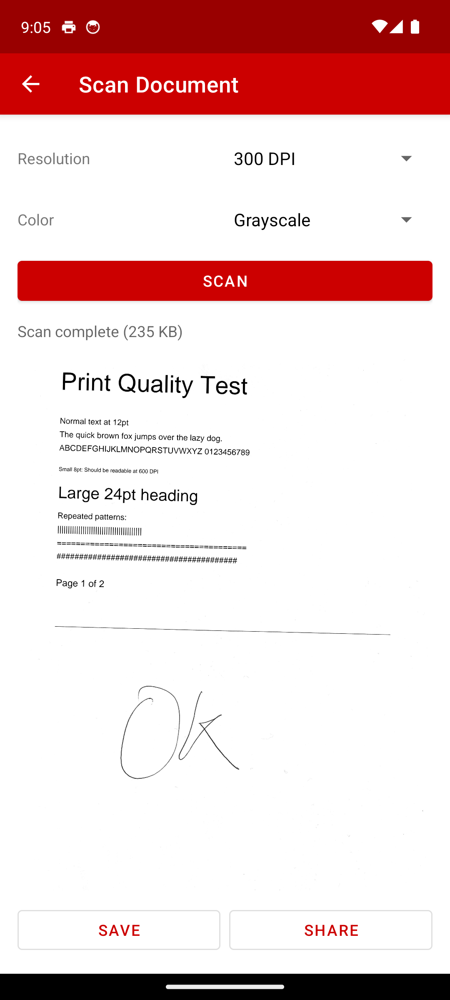
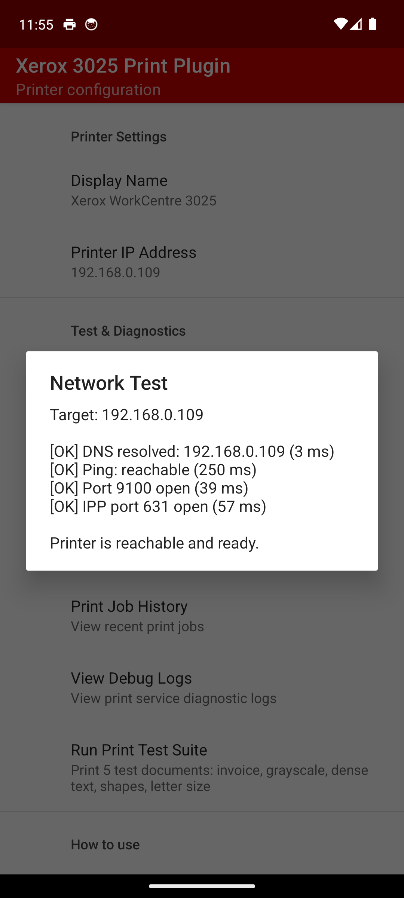

# Xerox WorkCentre 3025 — Android Print Plugin

Print and scan with a Xerox WorkCentre 3025 over Wi-Fi. No cloud, no accounts, no third-party servers. Just local printing and scanning that works.

> *I built this out of pure frustration. I have a perfectly good Xerox WorkCentre 3025 sitting on my desk, it works fine from my Mac and PC, but Android? Nothing. The official Xerox app fails, Mopria says "unsupported", and Google Cloud Print is long dead. The only alternatives I found were paid apps that want full network access and god knows what else — no thanks. So I wrote my own. It talks directly to the printer over your local Wi-Fi, nothing leaves your network, and it just works. Printing AND scanning. This is a working MVP — not pretty, but functional. If you have the same printer and the same frustration, this is for you.*

---

## Install

### Step 1: Download the APK

Download the latest APK from the [Releases page](../../releases/latest).

### Step 2: Install on your phone

1. Transfer the APK to your phone (email it to yourself, use a file manager, or download directly)
2. Open the APK file on your phone
3. If prompted, allow installation from unknown sources:
   - **Android 8+**: You'll see *"Your phone isn't allowed to install unknown apps from this source"* — tap **Settings** and enable **Allow from this source**
   - **Older Android**: Go to **Settings > Security** and enable **Unknown sources**
4. Tap **Install**

### Step 3: Set up the printer

1. Open the **Xerox 3025 Print Plugin** app
2. Set your **Printer IP Address** (you can find this on the printer's display or its config page)
3. Tap **Test Network Connection** to verify the printer is reachable

### Step 4: Enable the print service

1. Go to **Android Settings**
2. Navigate to **Connected devices > Printing** (or search for "Printing" in settings)
3. Find **Xerox 3025 Print Plugin** and turn it **ON**

> This step is required — Android won't use the plugin until you enable it.

### Step 5: Print!

Open any document, photo, or web page, tap **Share** or **Print**, and select **Xerox WorkCentre 3025** as the printer.

---

## Screenshots

  
  &nbsp;&nbsp;
  
  &nbsp;&nbsp;
  

  <em>Settings &nbsp;&nbsp;&nbsp;&nbsp;&nbsp;&nbsp;&nbsp;&nbsp;&nbsp;&nbsp;&nbsp;&nbsp;&nbsp;&nbsp;&nbsp;&nbsp;&nbsp;&nbsp;&nbsp;&nbsp;&nbsp;&nbsp;&nbsp;&nbsp;&nbsp;&nbsp;&nbsp;&nbsp;&nbsp; Scanner &nbsp;&nbsp;&nbsp;&nbsp;&nbsp;&nbsp;&nbsp;&nbsp;&nbsp;&nbsp;&nbsp;&nbsp;&nbsp;&nbsp;&nbsp;&nbsp;&nbsp;&nbsp;&nbsp;&nbsp;&nbsp;&nbsp;&nbsp;&nbsp;&nbsp;&nbsp;&nbsp;&nbsp;&nbsp; Network test</em>

---

## Features

- **Print from any app** — documents, photos, web pages, emails — anything that supports Android's print system
- **Scan documents** — scan from the flatbed scanner directly to your phone (JPEG, up to 300 DPI, color/grayscale/B&W)
- **100% local** — talks directly to the printer over Wi-Fi, nothing leaves your network
- **Network diagnostics** — test connectivity to your printer with one tap
- **Test pages** — verify the connection works before printing real documents
- **Job history** — see what you've printed and whether it succeeded
- **Notifications** — get notified when a print job completes or fails

## How it works

### Printing

The plugin acts as an Android Print Service. When you print from any app:

1. Android renders the document to PDF
2. The plugin renders each page to a 600 DPI bitmap
3. Bitmaps are converted to grayscale and encoded as URF (the format the printer expects)
4. The data is sent to the printer via IPP on port 631

> **Why do official apps fail?** The Xerox WorkCentre 3025 only accepts URF and QPDL formats — it doesn't support PCL, PostScript, or raw PDF that most Android print apps try to send.

### Scanning

The app uses the WSD (Web Services for Devices) protocol to communicate with the scanner:

1. Connects to the scanner on port 8018 via SOAP/XML
2. Creates a scan job with your chosen settings (resolution, color mode)
3. Retrieves the scanned image as JPEG
4. You can preview, save to Downloads, or share via any app

## Compatibility

| | |
|---|---|
| **Printer** | Xerox WorkCentre 3025 (may work with similar Samsung-engine Xerox models) |
| **Android** | 8.0 (Oreo) and above |
| **Paper sizes** | A4, US Letter, A5 |
| **Print quality** | 600 DPI, grayscale (monochrome printer) |
| **Connection** | Wi-Fi (printer and phone must be on the same network) |

## Troubleshooting

| Problem | Solution |
|---|---|
| Printer not in print dialog | Enable the plugin: Settings > Printing > Xerox 3025 Print Plugin > ON |
| Still not appearing | Clear print spooler: Settings > Apps > Show system > Print Spooler > Clear data |
| Print job fails | Open the app > **Test Network Connection** to check connectivity |
| Nothing comes out | Open the app > **View Debug Logs** for detailed error info |
| Wrong IP address | Check your printer's display or web interface at `http://<ip>/sws/index.html` |
| Scan fails | Make sure the scanner lid is closed and a document is on the flatbed |
| "No images available" | The scan job expired — try again, the scan starts immediately |

> **Tip:** Give your printer a static IP in your router's DHCP settings so it doesn't change.

## Privacy

This app:
- Makes **no internet connections** of any kind
- Has **no analytics, tracking, or telemetry**
- Only accesses your **local network** to reach the printer
- Stores settings **locally** on your device only
- Is fully **open source** — verify it yourself

## Roadmap

This is a working MVP. Possible future additions:

- [x] Scanning support
- [ ] Better UI (Material Design)
- [ ] Automatic printer discovery (no more typing IP addresses)
- [ ] Duplex printing
- [ ] Multi-page scan (ADF support if available)
- [ ] PDF export for scans
- [ ] Support for similar Xerox/Samsung SPL printers

[Contributions welcome!](docs/CONTRIBUTING.md)

## Acknowledgments

Built with the help of [Claude Code](https://claude.ai/code) — from reverse-engineering the printer's URF protocol to debugging Android's print service framework, it was an invaluable coding partner throughout this project.

## License

[MIT](LICENSE)
